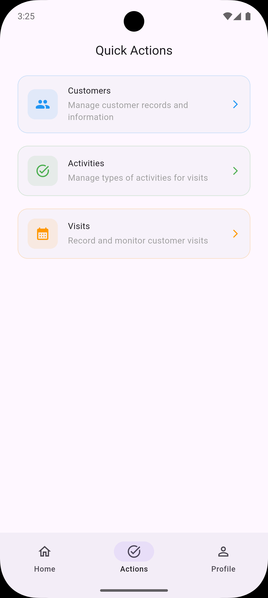
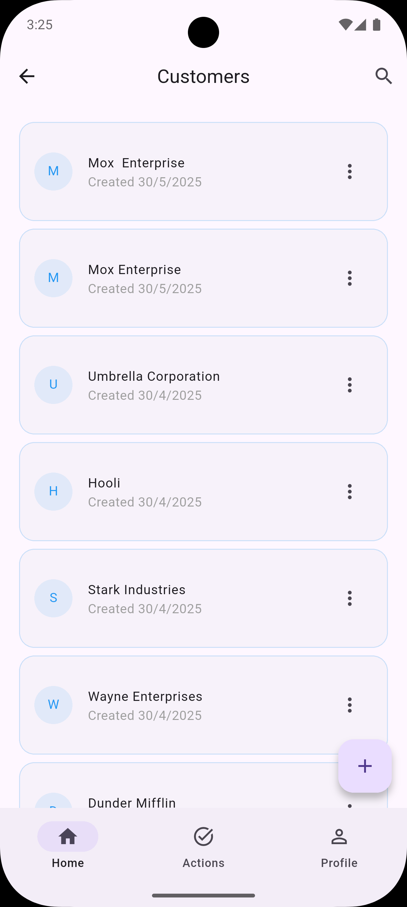
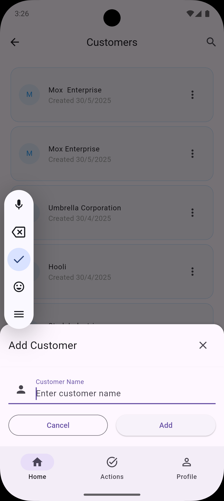
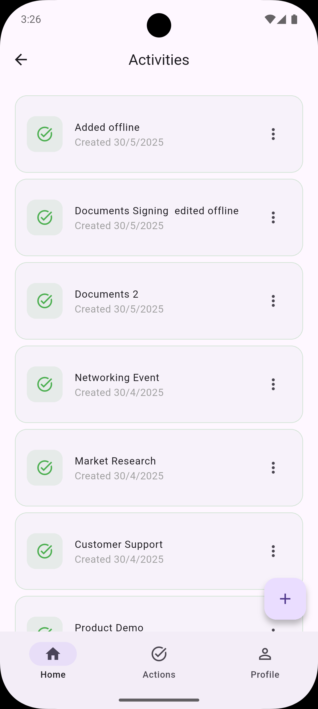
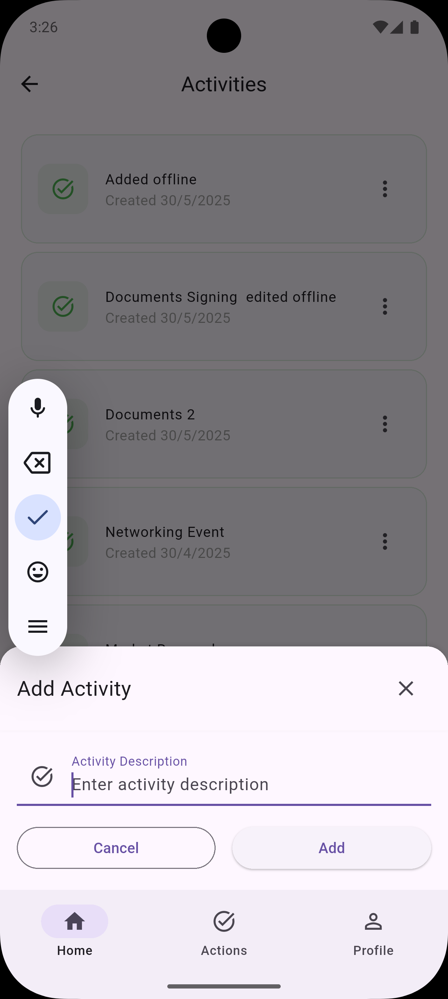

# Visits Tracker

A production-grade Flutter application for Route-to-Market (RTM) Sales Force Automation, built with clean architecture principles and modern development practices.

## Overview

Visits Tracker is a feature-rich mobile application that enables sales representatives to:

- Add and manage customer visits
- Track activities completed during visits
- View visit statistics and analytics
- Search and filter visits
- Work seamlessly in both online and offline modes

## 📱 App Preview

<div align="center">
  
  
  
  <br/>
  
  
  
</div>

## 📥 Download APK

You can download the latest APK version of the app from [here](https://drive.google.com/file/d/1qGuC5z4o9R3lZUpdyGt7GS-srOY8aLeP/view?usp=sharing).

## Key Features

- **Clean Architecture**: Implemented using a scalable, maintainable architecture pattern
- **Offline Support**: Full offline capabilities with request queuing and synchronization
- **State Management**: Provider-based state management for efficient UI updates
- **Modern Navigation**: Go Router implementation for type-safe routing
- **Theme Support**: Light and dark theme support with Material 3 design
- **Global Services**:
  - Network Service
  - Caching Service
  - Alert Service
  - Theme Service
  - Storage Service

## Technical Implementation

### Architecture

The application follows clean architecture principles with the following layers:

- **Presentation Layer**: UI components and state management
- **Domain Layer**: Business logic and use cases
- **Data Layer**: Repositories and data sources

### Key Components

1. **Core Services**:

   - `ApiClient`: Handles network requests
   - `CacheService`: Manages offline data and request queuing
   - `StorageService`: Handles local data persistence
   - `SupabaseService`: Manages Supabase API interactions

2. **Features**:

   - Customers management
   - Activities tracking
   - Visits management
   - Actions handling

3. **State Management**:
   - Provider pattern for state management
   - Separate providers for each feature
   - Global state for app-wide data

### Dependencies

- `provider`: State management
- `go_router`: Navigation
- `shared_preferences`: Local storage
- `http`: Network requests
- `connectivity_plus`: Network status monitoring
- `shimmer`: Loading effects
- `intl`: Internationalization

## Setup Instructions

1. Clone the repository:

   ```bash
   git clone [repository-url]
   ```

2. Install dependencies:

   ```bash
   flutter pub get
   ```

3. Create environment configuration:
   Create a new file at `lib/core/config/env_config.dart` with the following content:

   ```dart
   class EnvConfig {
     static const String supabaseUrl = 'supabase_url';
     static const String supabaseApiKey = 'api_key';
   }
   ```

4. Run the app:
   ```bash
   flutter run
   ```

## Offline Support

The application implements a robust offline-first approach:

- Local caching of data
- Request queuing when offline
- Automatic synchronization when online
- Conflict resolution for data consistency

## Testing

The project includes:

- Unit tests for business logic
- Widget tests for UI components
- Integration tests for feature flows

## Assumptions and Trade-offs

1. **Data Synchronization**:

   - Assumes eventual consistency model
   - Uses timestamp-based conflict resolution

2. **Offline Storage**:

   - Limited by device storage capacity
   - Prioritizes recent data

3. **API Integration**:
   - Assumes stable API endpoints
   - Implements retry mechanisms for failed requests

## Future Improvements

1. **Performance Optimization**:

   - Implement pagination for large datasets
   - Optimize image loading and caching

2. **Feature Enhancements**:

   - Add data export functionality
   - Implement advanced analytics
   - Add user authentication

3. **Testing**:
   - Expand test coverage
   - Add performance testing
   - Implement E2E testing

## Contributing

1. Fork the repository
2. Create a feature branch
3. Commit your changes
4. Push to the branch
5. Create a Pull Request

## License
